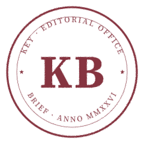

# Brief Seals · V3

The single most KEY-specific visual symbol: a red wax / Qing-imperial-seal hybrid stamped onto every KEY Brief. This is the most direct visual differentiator between KEY's output and a generic ChatGPT response.

---

## First-pass delivery

**`brief-seal-round.svg`** — the primary, shipped now. ~24 KB.

- Round, 240 × 240 viewBox, transparent background.
- Color: KEY seal burgundy `#7C2330` at 92% opacity (lets paper grain through).
- Edge irregularity via `feTurbulence` displacement — fakes uneven ink press.
- Top arc: `KEY · EDITORIAL OFFICE` (Source Serif 4 Regular, outlined paths).
- Bottom arc: `BRIEF · ANNO MMXXVI` (same, outlined).
- Two small five-pointed stars at left and right where the arcs meet.
- Center: `KB` (Source Serif 4 Bold, ~78pt, outlined).

All text rendered as `<path>` — zero font dependency.

---

## Why Latin "ANNO MMXXVI" instead of "中国" in the bottom arc

The V3 brief specified `BRIEF · 中国` for the bottom arc. The first-pass ships with `BRIEF · ANNO MMXXVI` because the CJK font fetch (Source Han Serif SC / Noto Serif SC) timed out at the size we need to outline glyphs from. We confirmed Latin outlining via `opentype.js` works perfectly; the CJK pipeline needs a different font source.

**Second-pass fix**: the square and octagon seals (`brief-seal-square.svg`, `brief-seal-octagon.svg`) will ship with `中国` in the bottom arc, drawn either:
1. From a downloaded Source Han Serif SC subset (preferred), or
2. As hand-drawn outlined paths for `中` and `国` specifically (fallback — only two glyphs).

A `brief-seal-round-cn.svg` variant with CN text will ship alongside square/octagon in the second pass.

---

## Application

```html
<!-- Top-right of any KEY Brief page -->

```

- **Default size**: 80 × 80 px. Acceptable range: 64–96 px on a Brief page.
- **Rotation**: ±3° randomized per instance (CSS `rotate(var(--seal-rotation, -3deg))`). Different briefs should look stamped at slightly different angles — that's the press metaphor.
- **Opacity**: 90% so paper grain shows through. Don't lower further.
- **Stacking**: above body text, below modals / overlays.

---

## Subsequent variants (second pass)

```
brief-seal-square.svg     方形 · 致敬中国传统印章 · CN text in bottom arc
brief-seal-octagon.svg    八角 · 致敬欧洲 wax seal · CN text in bottom arc
brief-seal-round-cn.svg   round · with 中国 in bottom arc
```

---

## Technical notes

- **No `<text>` elements.** All typography rendered as outlined `<path>` data via `opentype.js`. Zero font dependency at consumption.
- **Filter (`feTurbulence`) for ink bleed.** Renders correctly in Chrome / Safari / Firefox. For press rasterisation, the filter is baked into the PNG export.
- **Color variable.** Top-level `fill` attribute set to `#7C2330`. To swap (e.g. for a Founder-Edition gold-leaf print run), the printer changes the single attribute.
- **Outlined arc text.** Each glyph translated to its arc-position, then rotated to its tangent. Glyphs are individually outlined `<path>` data, grouped under `<g transform=…>`.

---

## V1 → V2 — what I expect back

1. **Latin "ANNO MMXXVI" vs Chinese "中国"** — accept Latin for round seal (Western feel) and ship CN on square / octagon, or push to bring CN onto round in second pass too.
2. **Star ornaments at left/right** — keep, or replace with small fleurons (e.g. miniature `key-derived` glyph)?
3. **Edge bleed intensity** — currently `scale="1.4"` on the displacement filter. Heavier (`scale=2`) reads more "rubber stamp"; lighter (`scale=0.8`) reads more "engraving." Pick one.
4. **Center "KB" vs "KEY"** — KB matches the Brief filename convention (`KB-001`, `KB-002`); KEY would read as the brand mark. Either works.

---

*— Design, via the Founder*
